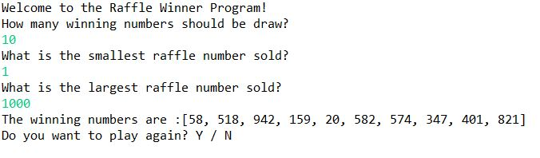
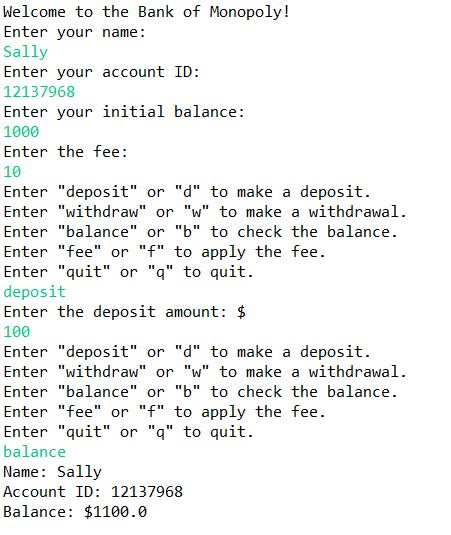
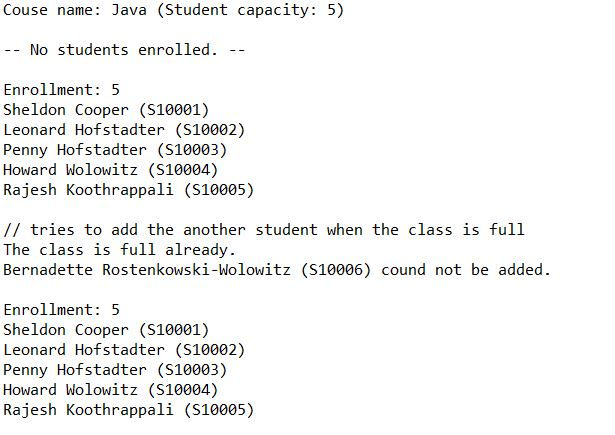
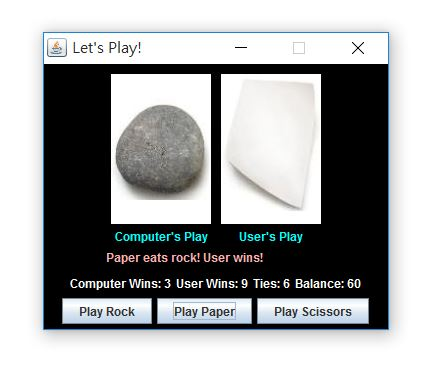

# Java- ProgrammingFundamentals
The course covers programming fundamentals using the Java language, using an object-oriented approach to problem solving. 
Topics include classes, objects, references, dynamic memory allocation, inheritance, polymorphism, arrays, files, 
design and implementation of abstract data types, in numerical and non-numerical applications.

- [x] [Project 1: Raffle Winners](https://github.com/Sally-Ng/Java-Raffle_Winners)
- [x] [Project 2: Bank Account](https://github.com/Sally-Ng/Java-Bank_Account)
- [x] [Project 3: Course Registration](https://github.com/Sally-Ng/Java-Course_Registration)
- [x] [Project 4: Rock, Paper, Scissors GUI](https://github.com/Sally-Ng/Java-Rock_Paper_Scissors_GUI)

## Project 1: Raffle Winners
Write a class to select random winners from a range of possible winning raffle ticket numbers.
 

  

## Project 2: Bank Account 
Create a bank account object and a interactive driver program that allow user to create and modify their bank account. 
 

  

## Project 3: Course Registration
Create courses and student accounts, then add students to the courses' roster.
 

  

## Project 4: Rock Paper Scissors GUI
Clicks the "Rock", "Paper" or "Scissors" button to play with the computer.
 

  

